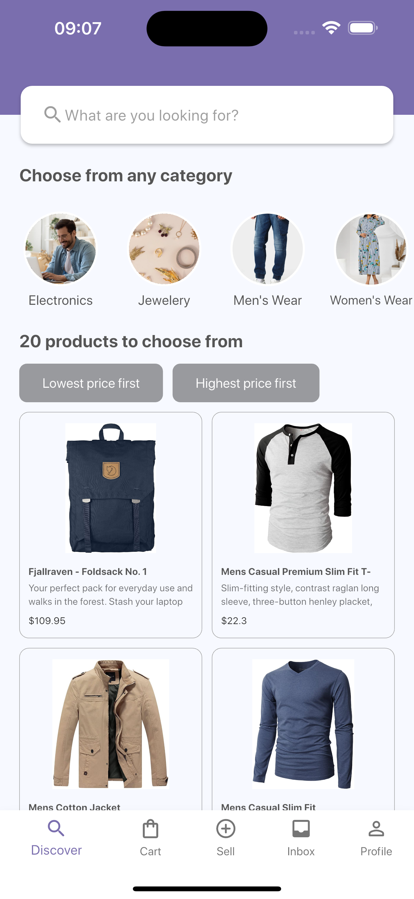
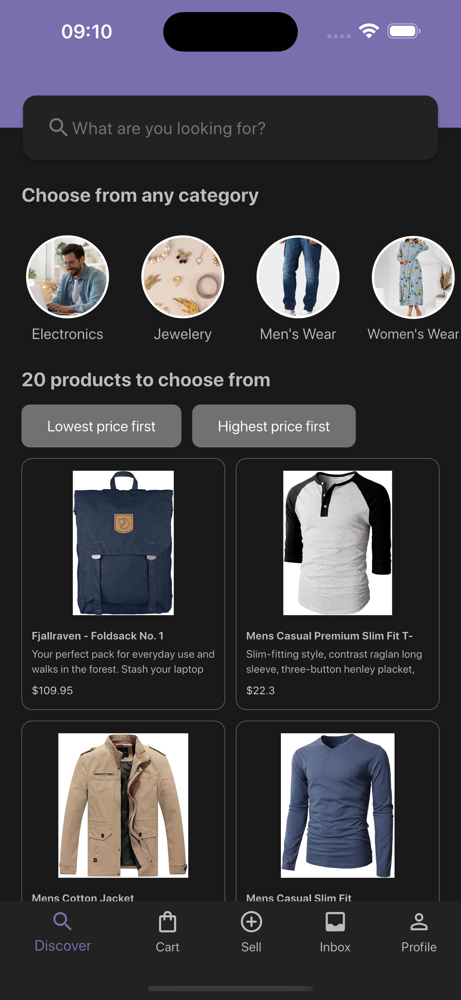
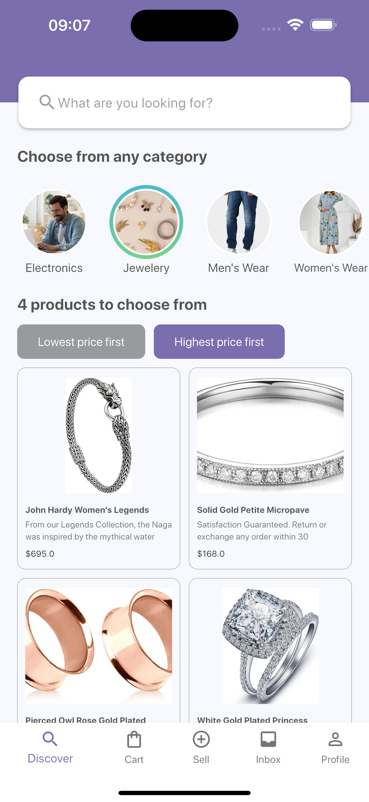
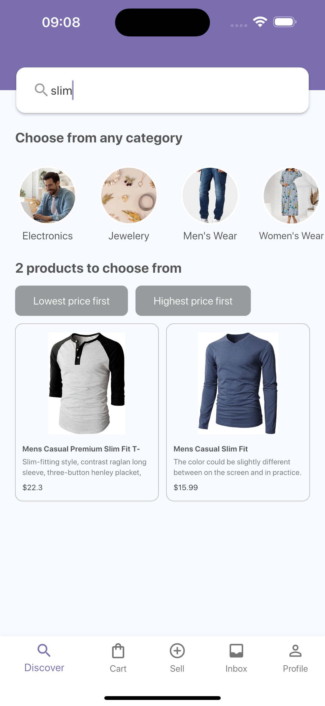

# Patch Shopping App

A modern, feature-rich shopping app built with Flutter. This app allows users to browse products by any desired methods like searching, sorting or filtering by categories.

---

## Table of Contents

1. [Overview](#overview)
2. [Features](#features)
3. [Screenshots](#screenshots)
4. [Installation](#installation)
6. [Tech Stack](#tech-stack)
7. [Folder Structure](#folder-structure)

---

## Overview

The **Patch Shopping App** is a cross-platform application designed for online shopping enthusiasts. It features a clean UI, efficient state management using Bloc for state management and http for network call handlings.

This project demonstrates how to build a scalable and maintainable Flutter app for e-commerce.

---

## Features

- Browse top 50 products
- Search products by their names
- Filter products by their categories
- Sort products by their prices
- Toggle dark and light theme based on OS preference

---

## Screenshots

### Discover page (Light theme)


### Discover page (Dark theme)


### Products filtered by category and sorted by price


### Products result by the search query


### Sample usage

---

## Installation

To set up the project locally, follow these steps:

1. Clone the repository:
   ```bash
   git clone https://github.com/walkmandede/patch_shopping_app.git

2. Navigate to the project directory:
   ```bash
   cd patch_shopping_app

3. Install dependencies
   ```bash
   flutter pub get

4. Run the app
   ```bash
   flutter run

## Tech Stack

- Frontend : Flutter(3.27.0), Dart(3.6.0)
- State Mangement : Bloc
- Architecture : Customized smaller variant of clean architecture
- Backend : Fake Store APIs - https://fakestoreapi.com/docs
- Targeted Running Device - iPhone 16 Plus simulator (iOS 18.0)

## Folder Structure
```bash
lib/
├── core/ 
   ├── common/          # Contains constants such as app-wide themes, enumerations, and extensions.
   ├── route/           # Manages app routing, including route definitions and navigation logic.
├── data/               # Handles data-related concerns like models and repositories.
   ├── models/          # Defines data models (e.g., Product, User) used throughout the app.
   ├── repositories/    # Implements data fetching and storage logic, acting as a bridge between UI and APIs.
├── network/           
   ├── api_utils.dart   # Contains utility functions for API calls, including HTTP client setup and request handling.
├── presentation/       # Handles the app's UI and presentation logic.
   ├── common_widgets/  # Includes reusable UI components used across multiple screens.
   ├── modules/         # Organized by features, grouping related screens, blocs, and widgets.
      ├── feature_name/
         ├── blocs/     # Contains business logic components (BLoC) for state management in the feature.
         ├── widgets/   # Feature-specific widgets used in the feature's UI.
         ├── feature_page.dart  # Main page or screen of the feature.
└── main.dart           # Entry point of the app, responsible for app initialization and bootstrapping.
